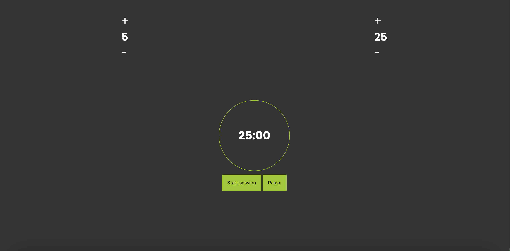

# Pomodoro-timer
The Pomodoro Timer project is a web-based application built with HTML, CSS, and TypeScript. This timer aids in productivity by allowing users to manage their work and break intervals using the Pomodoro Technique. The technique involves working for a set period, typically 25 minutes, followed by a short break, which helps maintain focus and reduce burnout. 
# Features
1. Session and Break Time Selection:
Users can specify the duration of their work (session) and break periods before starting the timer.
This feature allows customization to fit various productivity needs and preferences.
2. Starting the Timer:
The timer can be initiated with a single click after setting the desired durations for session and break times.
Upon starting, the timer begins counting down from the specified session duration.
3. Pausing the Timer:
Users can pause the timer at any point during the session or break.
This functionality ensures flexibility, accommodating interruptions without losing the current countdown state.
# Project Structure
## HTML
The HTML file provides the structure of the Pomodoro Timer interface. It includes elements for displaying the timer, buttons for starting and pausing, and input fields for setting session and break times.
## CSS
The CSS file enhances the visual appearance of the Pomodoro Timer. It includes styles for the layout, typography, and controls to ensure a user-friendly and aesthetically pleasing interface.
## Typescript
The TypeScript file includes the logic for the Pomodoro Timer. It manages the countdown, session and break intervals, and the start/pause functionality.
# Screenshot
